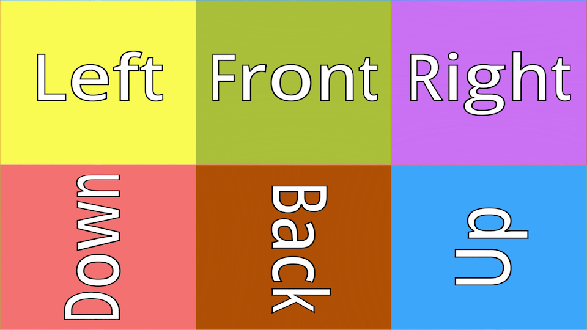
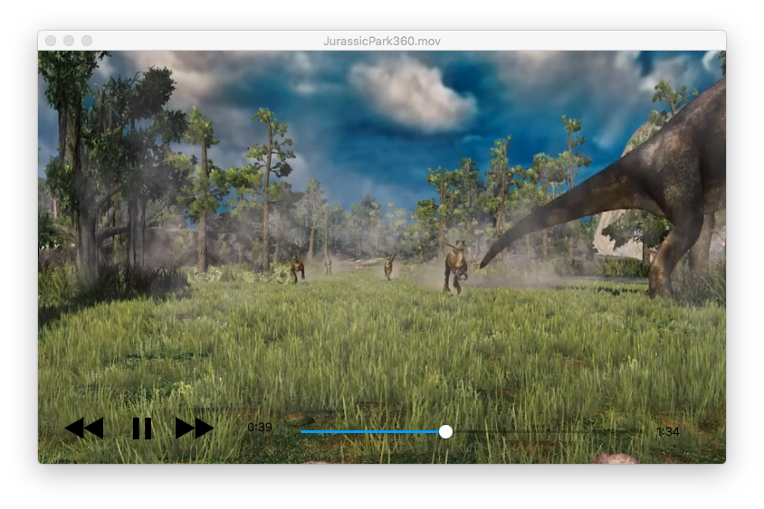
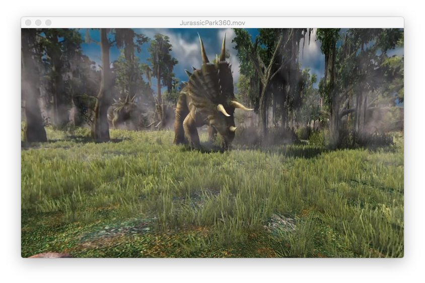
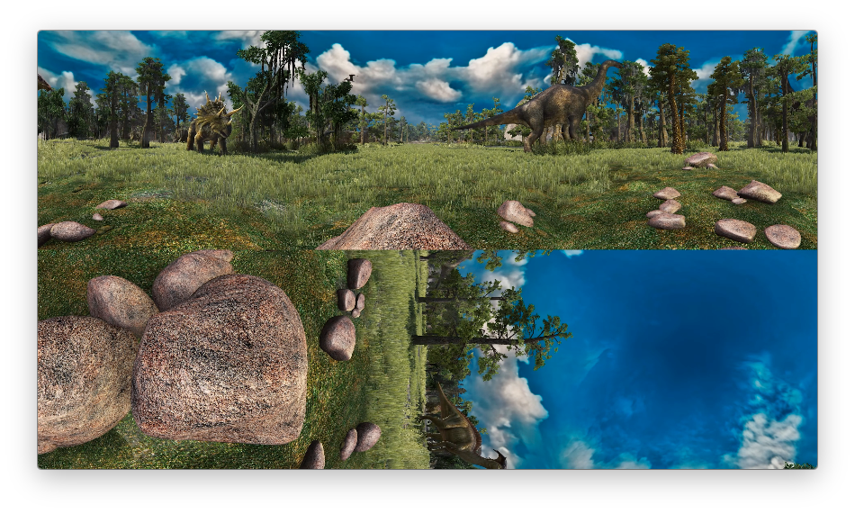

# A Youtube 360 Video Player With Metal

Play youtube videos using a custom interface that implements simple playback functionality.

## Overview

This is a basic video player which can be used to render youtube formatted videos. Each video frame is expected to be a compact map texture.

The source code of this application is derived on Apple's `Creating A Movie PlayerApp With Basic Playback Controls` and `360 Video Player With Metal`.  The AVFoundation objects that manage a player's visual output don't present any playback controls. On macOS, the classes `AVPlayerLayer` and `AVPlayerView` can be used to manage the visual output of an instance of AVPlayer. In fact, an instance of `AVPlayerView` can display visual content from an instance of AVPlayer along with some basic media controls supplied by the system.

However, since each frame of a youtube video needs to be processed before it can be output to the screen, performing that work can be speeded up using either OpenGL or Metal Shaders. Processing using Metal shaders is much faster compared to OpenGL shaders. Besides, on the macOS, the equivalent of  `CVMetalTextureCacheCreateTextureFromImage` is missing. The OpenGL equivalent, `CVOpenGLTextureCacheCreateTextureFromImage` does not support creating luminance and chrominance textures. An alternative is to use the function `CGLTexImageIOSurface2D` if macOS (10.10 or earlier) does not support Metal shaders. Furthermore, creating a CVPixelBuffer with a pixel format type of `kCVPixelFormatType_32BGRA`  is slow compared to `kCVPixelFormatType_420YpCbCr8BiPlanarVideoRange`.

Instead of using an instance of  MTKView  and implementing the required methods of MTKViewDelegate, the application's view is a simple custom sub-class of NSView backed by an instance of CAMetalLayer. The processing and display of each video frame is driven by a `CVDisplayLink` object. 

The `CVDisplayLink` object is configured to call its callback function on the main thread.  Each video frame is read and copied into an instance of *CVPixelBuffer* and send to a Metal renderer for processing. The MetalRendere's function `updateTextures` instantiates 2 `MTLTextures` from the CVPixelBuffer. Next, a Metal kernel function `YCbCrColorConversion` is called to combine these 2 textures (named lumaTexture and chromaTexture) into an RGBA MTLTexture (named `compactMapTexture`). The function `createCubemapTexture`  generates an Equi-Angular Cubemap texture (EAC) from the compact map texture. And finally, render the skybox.

3 short videos in youtube (compact) format were downloaded (see section of VideoLinks) and converted from *webm* to Apple supported video  *mov* or *mp4* formats. The converted videos are then used to test the video player. Because the size of these video files are relatively large, they are not included as part of the upload of this source code of this demo to github.com.

Before compiling this demo, the converted video file should be copied to the application's bundle resources. There is a Swift String constant `nameOfVideo` which must be edited to the filename of the user-supplied video file.

 
 
 

## Basic User Interface

The media controls at the bottom of the video display can be toggled on and off using the <space bar>. Play, Pause, Fast Forward and Fast Reverse are supported by clicking on the respective buttons. 

A slider is used to handle video scrubbing. Dragging on the slider's knob will call the function `timeSliderDidChange` to set the AVPlayer object's  play time to a new value. There will be a slight delay in the playback because the player object has to perform accurate seeking. 

Pressing the <ESC> key will toggle between fullscreen mode and normal window mode.

The media controls will be hidden after 10 seconds from first appearing/re-appearing on the screen. Just press the <space bar> to make them visible again.

Dragging the mouse will change the view perspective of the user. This allows the user to have a 360 degree view of the captured environment.

Note: if the background of a video frame is black, most of the media controls will not be visible.

 
 
 

**Snapshots:**

Snapshots when the video is played with Youtube360Player, 

Snapshot when the video is played with QuickTIme Player, 

 
 

**Requirements:** 

XCode 9.x, Swift 3.x

An Apple supported video format converted from a youtube webm format.
 
 

**Runtime Requirements:**

macOS 10.11
 
 

**Video links:**

Name of Video: MegaCoaster
https://www.youtube.com/watch?v=-xNN-bJQ4vI

Name of Video: Eye Of The Tiger
https://www.youtube.com/watch?v=xal78egELos

Name of Video: Jurassic Park
https://www.youtube.com/watch?v=3OSijZB2gE8

 
 

**References:**

CreatingAMoviePlayerAppWithBasicPlaybackControls

1) https://developer.apple.com/library/archive/samplecode/AVGreenScreenPlayer/Listings/AVGreenScreenPlayer_GSPlayerView_m.html

2) https://github.com/McZonk/MetalCameraSample

3) Technical Q&A: QA1501 and QA 1781

